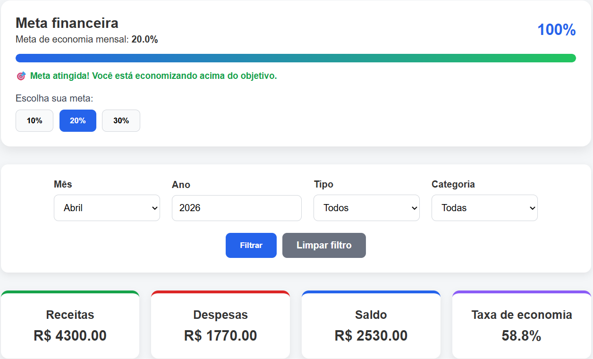
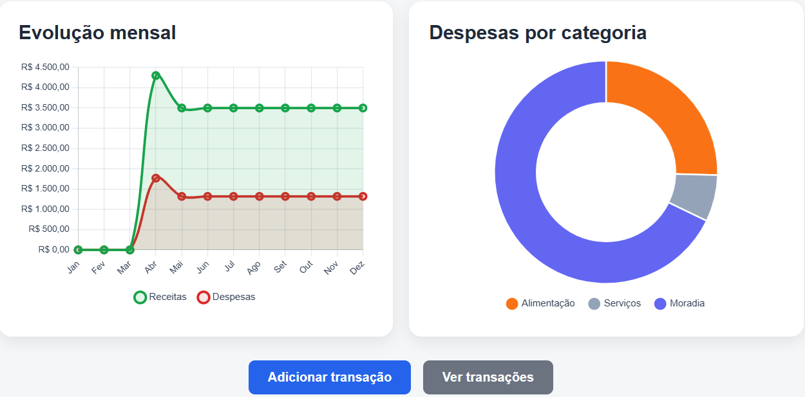
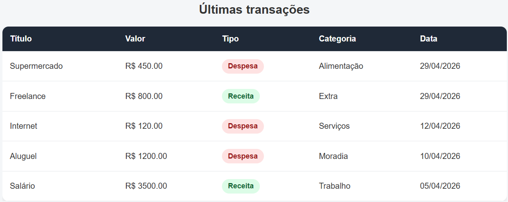
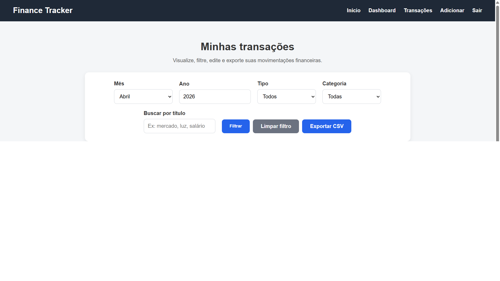
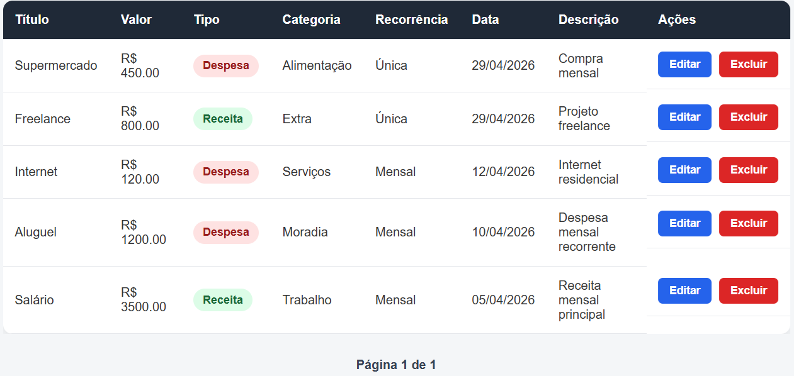

# 💰 Personal Finance Tracker

Sistema web de controle financeiro pessoal desenvolvido com **Python**, **Flask**, **SQLAlchemy**, **SQLite**, **PostgreSQL**, **Jinja2**, **CSS** e **Chart.js**.

O projeto permite organizar receitas e despesas, acompanhar saldo, visualizar gráficos, aplicar filtros avançados, registrar transações recorrentes, definir metas financeiras, receber alertas do mês, exportar dados em CSV e acessar uma conta demo para teste.

---

## 🔗 Acesse o projeto online

🌐 **Deploy:** [https://personal-finance-tracker-wrlj.onrender.com](https://personal-finance-tracker-wrlj.onrender.com)

---

## 📌 Sobre o projeto

O **Personal Finance Tracker** foi criado para ajudar usuários a registrarem e acompanharem suas movimentações financeiras de forma simples, clara e organizada.

A aplicação conta com autenticação de usuários, dashboard financeiro, CRUD completo de transações, filtros combinados, busca por título, recorrência mensal, exportação CSV, metas de economia, alertas financeiros e visualização gráfica dos dados.

Este projeto faz parte da construção do meu portfólio como desenvolvedor, demonstrando evolução em relação a projetos anteriores ao incluir regras de negócio mais completas, autenticação, banco de dados, dashboard analítico, deploy em produção e preocupação com responsividade.

---

## 🚀 Funcionalidades

### 👤 Autenticação de usuários

- Cadastro de conta
- Login
- Logout
- Controle de sessão
- Proteção de rotas privadas
- Tratamento de sessão expirada
- Senhas armazenadas com hash

### 🧪 Usuário demo

O sistema possui uma opção de acesso rápido com usuário demo.

Com ela, é possível testar a aplicação sem criar uma conta manualmente.

### 💸 Gerenciamento de transações

- Adicionar transações
- Editar transações
- Excluir transações
- Listar transações
- Cadastro de receitas
- Cadastro de despesas
- Descrição opcional
- Categorias padronizadas
- Validação de campos obrigatórios

### ♻️ Recorrência mensal

As transações podem ser cadastradas como:

- Única
- Mensal

Transações mensais continuam sendo consideradas nos meses seguintes, permitindo simular receitas e despesas recorrentes como salário, aluguel, internet e assinaturas.

### 📊 Dashboard financeiro

O dashboard apresenta:

- Total de receitas
- Total de despesas
- Saldo final
- Taxa de economia
- Últimas transações
- Resumo financeiro do mês
- Maior categoria de gasto
- Gráfico de evolução mensal
- Gráfico de despesas por categoria

### 🎯 Metas financeiras

O usuário pode escolher uma meta de economia mensal:

- 10%
- 20%
- 30%

O sistema calcula o progresso da meta com base na taxa de economia do mês selecionado.

### ⚠️ Alertas inteligentes

O sistema exibe alertas quando identifica situações importantes, como:

- Gastos maiores que receitas
- Aumento de despesas em relação ao mês anterior
- Categoria concentrando grande parte dos gastos

### 🔎 Filtros e busca

#### No dashboard

- Filtro por mês
- Filtro por ano
- Filtro por tipo
- Filtro por categoria

#### Na página de transações

- Filtro por mês
- Filtro por ano
- Filtro por tipo
- Filtro por categoria
- Busca por título

### 📄 Exportação CSV

O usuário pode exportar as transações filtradas para um arquivo **CSV**.

A exportação respeita os filtros aplicados na tela de transações.

### 📱 Responsividade

A interface foi ajustada para diferentes tamanhos de tela, incluindo desktop e mobile.

Foram feitos ajustes específicos para:

- navegação em telas menores;
- cards do dashboard;
- tabelas com rolagem horizontal;
- gráficos responsivos;
- exibição dos meses no gráfico de evolução mensal.

---

## 🛠️ Tecnologias utilizadas

- **Python**
- **Flask**
- **Flask-SQLAlchemy**
- **SQLAlchemy**
- **SQLite**
- **PostgreSQL**
- **HTML5**
- **CSS3**
- **Jinja2**
- **JavaScript**
- **Chart.js**
- **Gunicorn**
- **Render**

---

## 📂 Estrutura do projeto

```text
personal-finance-tracker/
│
├── app.py
├── models.py
├── requirements.txt
├── README.md
├── .gitignore
│
├── assets/
│   ├── 1-home.png
│   ├── 2-dashboard-summary.png
│   ├── 3-dashboard-summary.png
│   ├── 4-dashboard-chart.png
│   ├── 5-dashboard-chart.png
│   ├── 6-transactions.png
│   └── 7-transactions.png
│
├── templates/
│   ├── base.html
│   ├── index.html
│   ├── login.html
│   ├── register.html
│   ├── dashboard.html
│   ├── add_transaction.html
│   ├── edit_transaction.html
│   └── transactions.html
│
└── static/
    └── style.css
```

---

## ▶️ Como executar o projeto localmente

### 1. Clone o repositório

```bash
git clone https://github.com/Eduardo-S-Balbino/personal-finance-tracker.git
```

### 2. Entre na pasta do projeto

```bash
cd personal-finance-tracker
```

### 3. Crie um ambiente virtual

```bash
python -m venv venv
```

### 4. Ative o ambiente virtual

No Windows:

```bash
venv\Scripts\activate
```

No Linux/Mac:

```bash
source venv/bin/activate
```

### 5. Instale as dependências

```bash
pip install -r requirements.txt
```

### 6. Execute a aplicação

```bash
python app.py
```

### 7. Abra no navegador

```text
http://127.0.0.1:5000
```

---

## 🌐 Deploy

O projeto foi publicado no **Render**.

Em desenvolvimento local, a aplicação utiliza **SQLite**.

Em produção, a aplicação pode utilizar **PostgreSQL** por meio da variável de ambiente `DATABASE_URL`.

Comando de inicialização usado em produção:

```bash
gunicorn app:app
```

---

## 📸 Telas do sistema

O sistema possui as seguintes telas principais:

- Login
- Acesso demo
- Dashboard financeiro
- Meta financeira
- Gráficos financeiros
- Últimas transações
- Lista de transações
- Filtros avançados
- Exportação CSV

---

## 📸 Preview

### Login e acesso demo


### Dashboard - Resumo inicial


### Dashboard - Meta financeira e indicadores



### Dashboard - Gráficos financeiros



### Dashboard - Últimas transações



### Transações - Filtros e exportação



### Transações - Lista completa



---

## 📈 Exemplo de uso

Um usuário pode:

1. Criar uma conta ou entrar como usuário demo.
2. Fazer login no sistema.
3. Cadastrar receitas e despesas.
4. Definir transações como únicas ou mensais.
5. Visualizar receitas, despesas, saldo e taxa de economia no dashboard.
6. Acompanhar a evolução mensal por gráfico.
7. Ver despesas agrupadas por categoria.
8. Definir uma meta de economia mensal.
9. Receber alertas financeiros automáticos.
10. Aplicar filtros por mês, ano, tipo e categoria.
11. Buscar transações por título.
12. Navegar entre páginas da listagem.
13. Exportar as transações filtradas em CSV.

---

## 🧠 Regras de negócio implementadas

- Cada usuário visualiza apenas as próprias transações.
- Rotas privadas exigem login.
- Senhas são armazenadas com hash.
- Sessões inválidas ou expiradas são tratadas sem quebrar a aplicação.
- Transações recorrentes mensais continuam impactando meses futuros.
- O dashboard recalcula os valores com base nos filtros selecionados.
- A taxa de economia é calculada com base em receitas, despesas e saldo.
- A meta financeira compara o percentual economizado com o objetivo escolhido.
- Os alertas são gerados com base no comportamento financeiro do mês.
- O gráfico de categorias considera apenas despesas.
- O gráfico de evolução mensal compara receitas e despesas ao longo do ano.
- A exportação CSV respeita os filtros aplicados.
- A busca por título funciona em conjunto com os demais filtros.
- A paginação organiza os resultados sem perder os filtros aplicados.

---

## ✅ Funcionalidades implementadas

- [x] Cadastro de usuário
- [x] Login e logout
- [x] Hash de senha
- [x] Usuário demo
- [x] Proteção de rotas
- [x] Tratamento de sessão expirada
- [x] CRUD completo de transações
- [x] Cadastro de receitas
- [x] Cadastro de despesas
- [x] Recorrência mensal
- [x] Dashboard financeiro
- [x] Total de receitas
- [x] Total de despesas
- [x] Saldo final
- [x] Taxa de economia
- [x] Meta financeira mensal
- [x] Alertas inteligentes
- [x] Gráfico de evolução mensal
- [x] Gráfico de despesas por categoria
- [x] Filtro por mês e ano
- [x] Filtro por tipo
- [x] Filtro por categoria
- [x] Busca por título
- [x] Exportação CSV
- [x] Paginação
- [x] Categorias padronizadas
- [x] Responsividade mobile
- [x] Deploy em produção no Render

---

## 🔮 Melhorias futuras

Algumas melhorias que podem ser adicionadas futuramente:

- Recuperação de senha
- Filtro por intervalo de datas
- Mais tipos de recorrência
- Edição de categorias personalizadas
- Relatórios financeiros mais avançados
- Comparativo entre períodos
- Tema escuro
- Testes automatizados
- Melhorias adicionais de acessibilidade

---

## 📚 Aprendizados com este projeto

Durante o desenvolvimento deste sistema, pratiquei e consolidei conhecimentos em:

- estruturação de aplicações Flask;
- criação de rotas e templates com Jinja2;
- integração com banco de dados usando SQLAlchemy;
- autenticação e controle de sessão;
- proteção de rotas privadas;
- validação de formulários;
- implementação de regras de negócio;
- manipulação de filtros no backend;
- cálculo de indicadores financeiros;
- criação de dashboards;
- uso de gráficos com Chart.js;
- exportação de dados em CSV;
- responsividade com CSS;
- deploy de aplicação Flask no Render;
- organização de projeto para portfólio.

---

## 🎯 Objetivo profissional

Este projeto faz parte do meu processo de evolução como desenvolvedor, com foco em construir aplicações web cada vez mais completas, organizadas e próximas de cenários reais de uso.

A proposta foi ir além de um CRUD simples, adicionando autenticação, dashboard, recorrência, filtros avançados, exportação, metas financeiras, alertas automáticos, responsividade e deploy em produção.

---

## 👨‍💻 Autor

**Eduardo da Silva Balbino**

- GitHub: [Eduardo-S-Balbino](https://github.com/Eduardo-S-Balbino)
- LinkedIn: [eduardo-da-silva-balbino-1611b3401](https://www.linkedin.com/in/eduardo-da-silva-balbino-1611b3401/)
- Portfólio: [portfolio-ekgq.onrender.com](https://portfolio-ekgq.onrender.com/)

---

## 📄 Licença

Este projeto foi desenvolvido para fins de estudo, prática e portfólio.