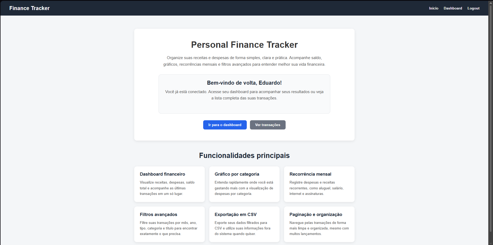
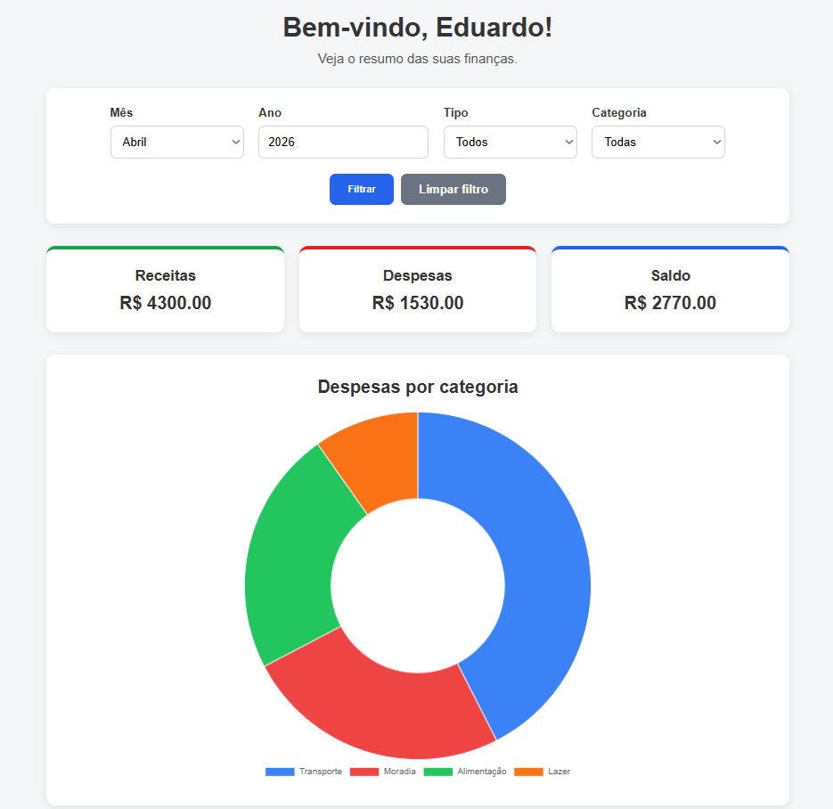
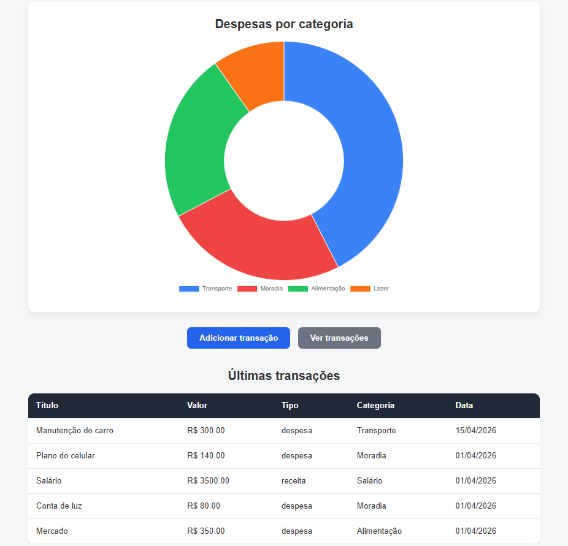
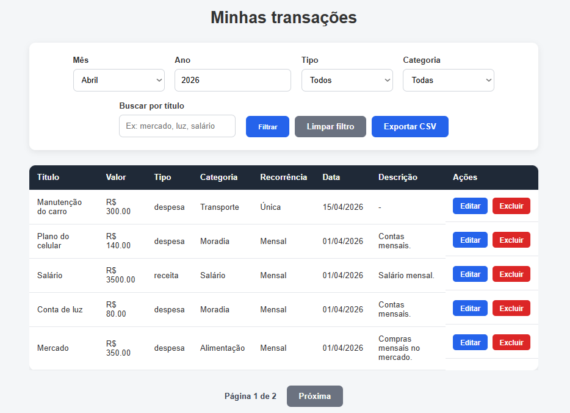

# 💰 Personal Finance Tracker

Um sistema web de controle financeiro pessoal desenvolvido com **Python**, **Flask** e **SQLite**, com foco em organização de receitas e despesas, visualização de saldo, filtros avançados, recorrência mensal, exportação de dados e dashboard com gráfico.

---

## 📌 Sobre o projeto

O **Personal Finance Tracker** foi criado para ajudar usuários a registrarem e acompanharem suas movimentações financeiras de forma simples, organizada e prática.

O sistema permite cadastrar receitas e despesas, aplicar filtros por período, tipo e categoria, visualizar resumos financeiros em um dashboard, trabalhar com transações recorrentes mensais, buscar lançamentos por título, paginar resultados e exportar dados em CSV.

Este projeto foi desenvolvido como parte da construção do meu portfólio em desenvolvimento web com Python, mostrando evolução em relação a projetos anteriores ao incluir autenticação, regras de negócio mais reais, dashboard analítico, filtros combinados, busca, paginação e exportação de dados.

---

## 🚀 Funcionalidades

### 👤 Autenticação de usuários
- Cadastro de conta
- Login
- Logout
- Controle de sessão
- Proteção de rotas privadas

### 💸 Gerenciamento de transações
- Adicionar transações
- Editar transações
- Excluir transações
- Listar transações
- Cadastro de receitas e despesas

### ♻️ Recorrência mensal
- Transações podem ser definidas como:
  - Única
  - Mensal
- Transações mensais continuam sendo consideradas nos meses seguintes no dashboard e nos filtros

### 📊 Dashboard financeiro
- Total de receitas
- Total de despesas
- Saldo final
- Últimas transações
- Gráfico de despesas por categoria

### 🔎 Filtros e busca

#### No dashboard:
- Filtro por mês
- Filtro por ano
- Filtro por tipo
- Filtro por categoria

#### Na página de transações:
- Filtro por mês
- Filtro por ano
- Filtro por tipo
- Filtro por categoria
- Busca por título

### 📄 Exportação
- Exportação das transações filtradas para arquivo **CSV**

### 📚 Organização e usabilidade
- Categorias padronizadas
- Paginação na lista de transações
- Interface web organizada
- Mensagens de feedback para ações do usuário

---

## 🛠️ Tecnologias utilizadas

- **Python**
- **Flask**
- **Flask-SQLAlchemy**
- **HTML**
- **CSS**
- **Jinja2**
- **SQLite**
- **JavaScript**
- **Chart.js**

---

## 📂 Estrutura do projeto

    personal-finance-tracker/
    │
    ├── app.py
    ├── requirements.txt
    ├── README.md
    ├── instance/
    │   └── finance.db
    │
    ├── templates/
    │   ├── base.html
    │   ├── index.html
    │   ├── login.html
    │   ├── register.html
    │   ├── dashboard.html
    │   ├── add_transaction.html
    │   ├── edit_transaction.html
    │   └── transactions.html
    │
    └── static/
        └── style.css

---

## ▶️ Como executar o projeto localmente

### 1. Clone o repositório

    git clone <URL_DO_SEU_REPOSITORIO>

### 2. Entre na pasta do projeto

    cd personal-finance-tracker

### 3. Instale as dependências

    pip install -r requirements.txt

### 4. Execute a aplicação

    python app.py

### 5. Abra no navegador

    http://127.0.0.1:5000

---

## 📸 Telas do sistema

O sistema possui páginas como:

- Home
- Login
- Cadastro
- Dashboard financeiro
- Adicionar transação
- Editar transação
- Lista de transações
- Exportação CSV

Você pode adicionar prints do projeto aqui depois para deixar o repositório ainda mais profissional.

Exemplo:

## 📸 Preview

---

## 📈 Exemplo de uso

Um usuário pode:

1. Criar uma conta
2. Fazer login no sistema
3. Cadastrar receitas e despesas
4. Marcar determinadas transações como mensais
5. Visualizar o saldo atualizado no dashboard
6. Aplicar filtros por mês, ano, tipo e categoria
7. Buscar transações por título
8. Navegar entre páginas da listagem
9. Exportar as transações filtradas em CSV

---

## 🧠 Regras de negócio implementadas

- Cada usuário vê apenas as próprias transações
- Rotas privadas exigem login
- Senhas são armazenadas com hash
- Transações recorrentes mensais continuam impactando meses futuros
- O dashboard recalcula os valores com base nos filtros selecionados
- O gráfico considera despesas agrupadas por categoria
- A exportação CSV respeita os filtros aplicados
- A busca por título funciona junto com os filtros existentes
- A paginação organiza os resultados sem perder os filtros aplicados

---

## ✅ Funcionalidades já implementadas

- [x] Cadastro de usuário
- [x] Login e logout
- [x] Hash de senha
- [x] CRUD completo de transações
- [x] Dashboard financeiro
- [x] Gráfico de despesas por categoria
- [x] Filtro por mês e ano
- [x] Filtro por tipo
- [x] Filtro por categoria
- [x] Busca por título
- [x] Recorrência mensal
- [x] Exportação CSV
- [x] Paginação
- [x] Categorias padronizadas

---

## 🔮 Melhorias futuras

Algumas melhorias que podem ser adicionadas no futuro:

- Responsividade ainda mais refinada
- Tema escuro
- Definição de metas financeiras
- Relatórios mais avançados
- Mais tipos de recorrência
- Recuperação de senha
- Deploy em produção
- Integração com PostgreSQL
- Dashboard com mais gráficos
- Filtro por intervalo de datas

---

## 📚 Aprendizados com este projeto

Durante o desenvolvimento deste sistema, pratiquei e consolidei conhecimentos em:

- estruturação de aplicações Flask
- rotas e templates com Jinja2
- integração com banco de dados usando SQLAlchemy
- autenticação e controle de sessão
- validação de formulários
- implementação de regras de negócio reais
- manipulação de listas e filtros no backend
- exportação de dados em CSV
- gráficos no front-end com Chart.js
- organização de projeto para portfólio

---

## 🎯 Objetivo profissional

Este projeto faz parte do meu processo de evolução como desenvolvedor, com foco em construir aplicações web cada vez mais completas, organizadas e próximas de cenários reais de uso.

A proposta foi ir além de um CRUD simples, adicionando autenticação, dashboard, recorrência, filtros avançados, exportação e melhor experiência de navegação.

---

## 👨‍💻 Autor

**Eduardo da Silva Balbino**

- GitHub: [Eduardo-S-Balbino](https://github.com/Eduardo-S-Balbino)
- LinkedIn: [eduardo-da-silva-balbino-1611b3401](https://www.linkedin.com/in/eduardo-da-silva-balbino-1611b3401/)
- Portfólio: [portfolio-ekgq.onrender.com](https://portfolio-ekgq.onrender.com/)

---

## 📄 Licença

Este projeto foi desenvolvido para fins de estudo, prática e portfólio.